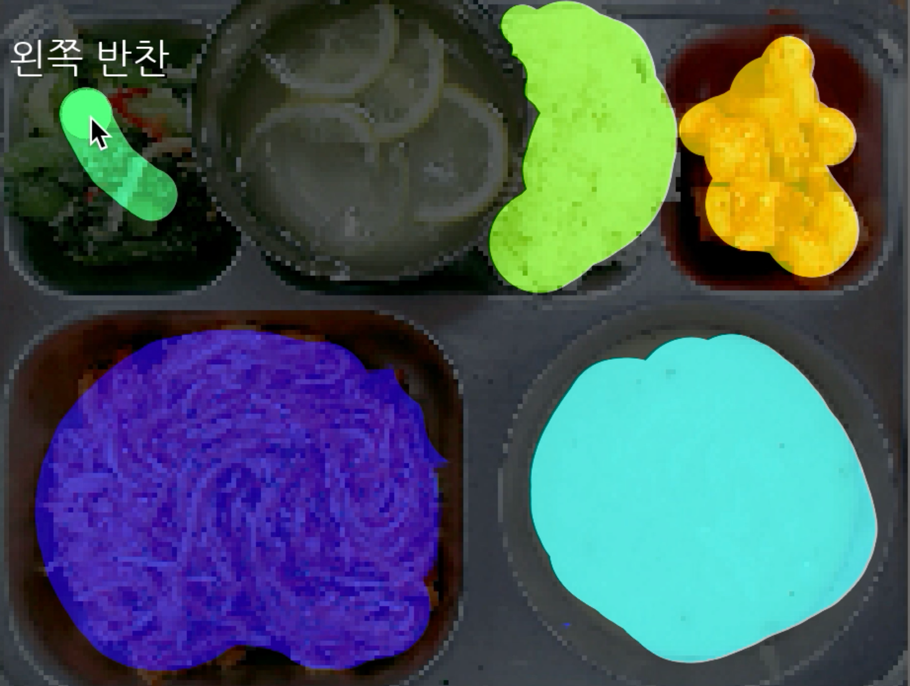
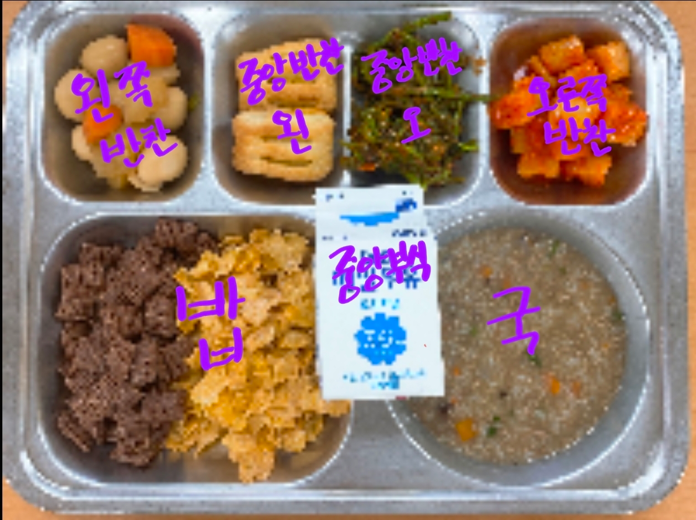
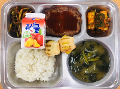

# Labelling Tool

  
**[youtube](https://www.youtube.com/watch?v=aZkA_e4oAQY)**

## Prerequisites
- Python
- OpenCV
- NumPy

 

## 조작키

1 : 브러쉬의 크기를 작게하기.  
2 : 브러쉬의 크기를 키우기  
l : 라벨 / 이미지+라벨 전환  

m : 다음 사진으로 전환  
n : 이전 사진으로 전환

 

### 클래스 분류

위치를 기준으로 분류 합니다.   

  

#### 클래스 선택 단축키

z: 밥  
x: 중앙 부식 (보통 우유)  
c: 국  
a: 왼쪽 반찬  
s: 중앙 반찬 (윈쪽)  
d: 중앙 반찬 (오른쪽)  
f: 오른쪽 반찬  
g: 식판에 걸쳐있는 부식  
       
 

  
*쥬시쿨은 식판에 걸쳐있는 부식으로 분류합니다.*